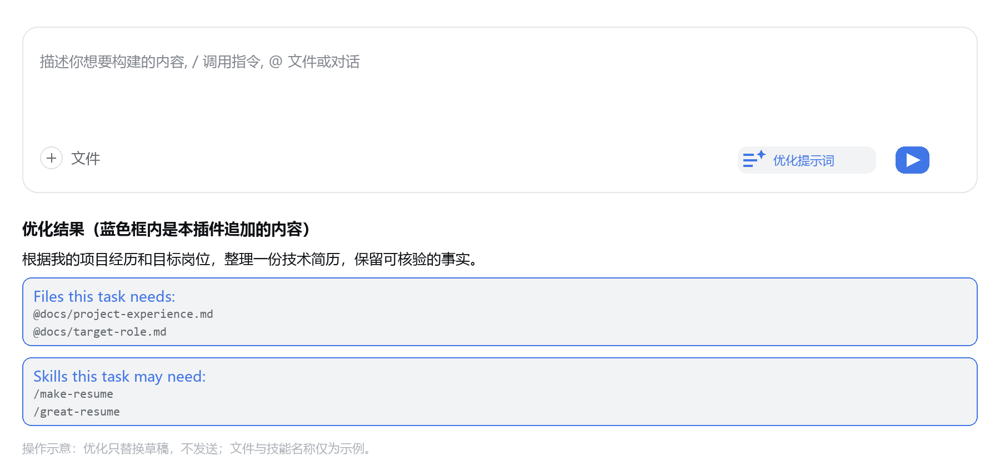
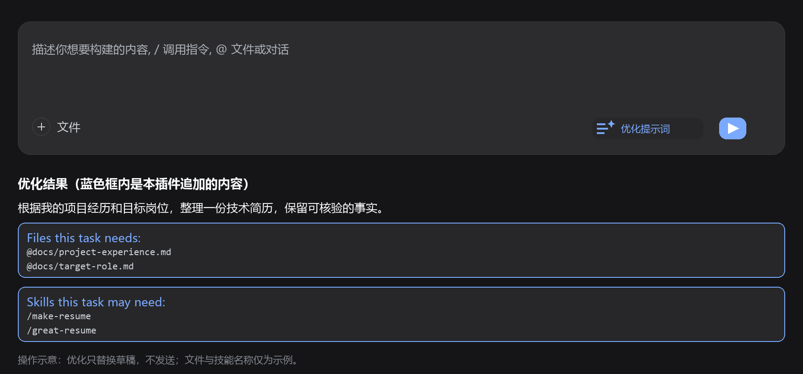
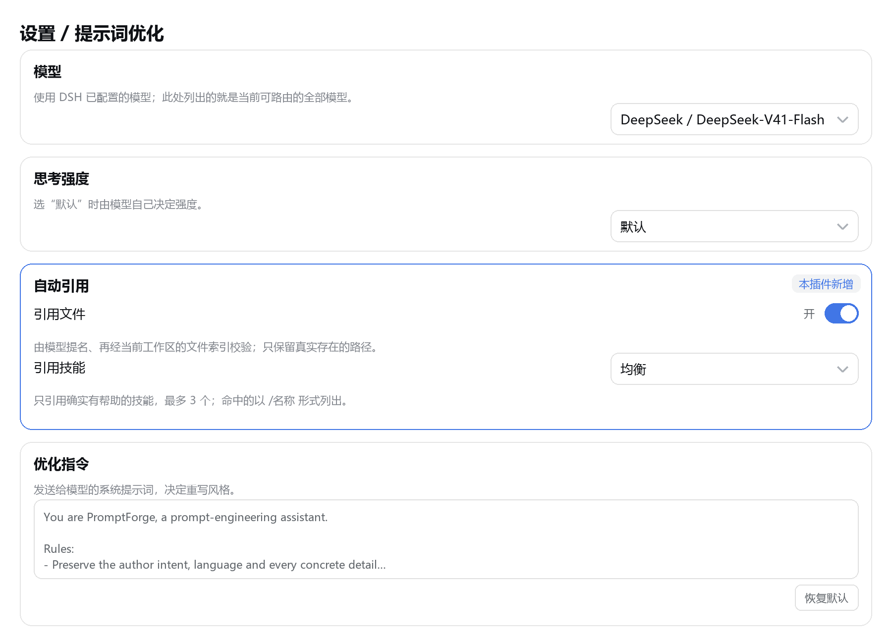

# 提示词优化（PromptForge）

DeepSeek Harness（DSH）的提示词优化插件。发送消息之前，用 DSH 已配置的模型整理当前草稿，并可追加经过校验的文件与技能引用。

**优化结果只替换输入框内容，不会自动发送。首次安装或更新插件后，请重新启动 DeepSeek Harness。**

## 功能演示



*操作示意：点击发送控件旁的「优化提示词」，检查改写后的正文及末尾引用，再自行发送。蓝色框用于突出引用块；示例文件和技能需在实际工作区中存在，才可能被追加。*



*深色主题示意。按钮图标由文本线条和星形标记组成，颜色跟随 DSH 主题。以上图片为绘制的说明图，不是运行截图，也不代表每次调用都会返回这些引用。*

## 主要功能

- **改写草稿**：保留原意、语言和具体细节，整理表达并补充有用的任务维度；可自定义优化指令。
- **独立选择模型**：复用 DSH 的模型配置与凭证，可跟随默认模型，也可单独选择模型和思考强度。
- **引用文件**：模型提名路径后，通过当前会话工作区的文件索引校验，再追加 `@路径`。
- **引用技能**：通过当前会话可见的技能目录校验，再追加 `/技能名`；提供关闭、严格、均衡和宽松四档。
- **保护草稿**：请求失败时保留原稿；请求期间编辑、发送或切换会话后，迟到的结果不会覆盖当前输入。

优化调用不会改变聊天会话的模型或思考强度，也不会作为聊天消息写入会话历史。

## 安装

### 从插件界面安装

1. 打开 DSH 的「插件 → 添加插件」。
2. 输入本仓库地址：

   ```text
   https://github.com/Super-Gagaga/PromptForge.git
   ```

3. 安装完成后重新启动 DSH，确认「提示词优化」已启用。
4. 确认 DSH 中至少配置了一个可用模型，然后打开「设置 → 提示词优化」。

### 从本地仓库安装

本地开发需要 Git、Node.js 和可用的 `dsh` 命令。构建无需额外 npm 依赖。

```powershell
git clone https://github.com/Super-Gagaga/PromptForge.git
cd PromptForge
npm run build
```

对可由 CLI 管理的 profile，使用仓库的绝对路径安装。下面的 profile 名和路径为示例，请替换为自己的配置：

```powershell
dsh plugin --profile my-profile add 'link:C:/Projects/PromptForge'
```

安装或更新后重启对应的 DSH 实例。桌面 profile 由应用管理；不要把上述 CLI profile 当成桌面 profile。

## 使用流程

1. 在「设置 → 提示词优化」选择优化模型与思考强度，按需修改优化指令。
2. 进入会话，在输入框写下草稿。有文字时会显示「优化提示词」按钮。
3. 点击按钮并等待完成。处理期间按钮显示加载状态，避免重复调用。
4. 检查替换后的草稿、文件和技能引用，必要时继续编辑，再点击发送。

默认指令在原意内适度展开，不强制固定模板。自定义指令可用于调整重写风格；「恢复默认」会恢复当前版本内置的优化指令。

### 设置说明



*设置页示意：模型、思考强度、自动引用和优化指令分别配置。图中的模型仅为展示示例，实际选项来自你的 DSH 模型目录。*

| 设置 | 行为 |
| --- | --- |
| 模型 | 跟随部署默认模型，或使用单独选择的提供方与模型 |
| 思考强度 | 使用所选模型提供的等级；「默认」交给模型适配器处理 |
| 引用文件 | 默认开启；关闭后不追加新的文件引用 |
| 引用技能 | 默认均衡；可改为关闭、严格或宽松 |
| 优化指令 | 决定重写风格，支持编辑与恢复默认 |

设置修改后自动保存，页面会显示保存状态；保存失败时会显示错误。切换优化模型会清空原有的思考强度选择，避免沿用不适合新模型的等级。

### 自动引用

开启自动引用后，模型在改写时提名文件与技能。插件校验这些提名，只追加确认可用的项目。某一类没有有效提名时，插件还可能列出真实候选，再进行一次补充提名请求，因此开启引用可能增加调用次数和等待时间。

以下是引用格式示例：

```text
Files this task needs:
@docs/project-experience.md
@docs/target-role.md

Skills this task may need:
/make-resume
/great-resume
```

`@路径` 为文件或目录引用，是否读取由 DSH 的 Agent 决定；`/技能名` 为 DSH 的技能调用手势，发送后由 DSH 处理。技能必须在当前会话的目录中可见，且同时允许模型调用和用户调用，名称也必须符合手势语法。

| 技能档位 | 提名规则 |
| --- | --- |
| 关闭 | 不追加技能引用 |
| 严格 | 请求明确需要该能力或任务离不开它时才提名，最多 2 个 |
| 均衡 | 提名确实有帮助的技能，最多 3 个 |
| 宽松 | 提名可能有帮助的技能，最多 3 个 |

档位调整模型的选择标准，所有档位都经过同样的目录校验。文件提名最多 5 个；含空格的路径按 DSH 的引用语法处理，歧义路径不会猜选。已有引用会合并去重，新增引用超出长度限制时会被省略。

如果检测到改写丢失原稿中的路径或引用，插件会保留原稿。引用处理失败或超时时，仍可返回有效的改写正文和已确认的引用。最近一次处理状态会显示在按钮提示和设置页，包括引用已确认、未发现相关引用、处理未完成和原稿已保留。

## 常见问题

**按钮没有出现**

先在输入框输入文字，确认插件已启用，并在安装或更新后重启 DSH。浏览器刷新不能代替 Host 插件的重新加载。

**没有模型，或优化失败**

先确认 DSH 本身能调用所选模型，再检查插件设置中的模型。错误会显示在按钮提示和设置页；原草稿会保留。

**没有追加文件或技能**

确认对应引用功能已开启、会话已关联正确工作区，以及文件索引和技能目录可用。没有相关引用也可能是正常结果；开启引用不保证每次都能找到合适的项目。

**为什么优化后草稿没有变化？**

如果请求期间编辑了草稿、发送了消息或切换了会话，插件会丢弃返回结果。检测到原始路径丢失时，也会保留原稿。

**等待时间较长**

耗时取决于模型、工作区索引与补充提名请求，不提供固定完成时间。单次模型请求超时为 120 秒；初次改写之后的引用处理另有 15 秒总预算。

**启用时提示 `pending (waiting for service: optional)`**

更新到当前构建并重启 DSH。当前实现已改为按需获取服务，不使用导致该问题的 `inject: { optional: [...] }` 写法。

## 开发与验证

编辑 `src/` 后重新构建，不要直接修改生成的 `lib/` 和根目录镜像。

```powershell
npm run build   # 构建插件
npm test        # 构建、全部离线测试（单元 44 项 + 自检 87 项）、源码覆盖率门槛、配图存在性及文档链接检查
npm run docs    # 单独检查 Markdown 链接与代码围栏
```

| 路径 | 用途 |
| --- | --- |
| `src/client.js` | 优化按钮、草稿保护、设置页和中英文文案 |
| `src/host.js` | 设置存储、模型请求、引用校验和 HTTP 接口 |
| `src/shared.js` | 默认指令、引用格式、状态及各项限制 |
| `locale/` | DSH 插件列表中的显示名称与描述 |
| `cordis.patch.yml` | 插件装配配置 |
| `tools/selfcheck.mjs` | 使用隔离设置目录的离线自检 |
| `tools/make-figures.mjs` | README 说明图生成器 |

构建同步生成 `lib/index.js`、`lib/client.js` 及根目录中的同名镜像。设置存储在 `$DSH_HOME/prompt-forge.json`；未指定 `DSH_HOME` 时，使用用户目录下的 `.dsh/prompt-forge.json`。单次草稿上限为 60,000 字符，模型输出上限为 4,096 tokens。

配图可通过 `npm run figures` 重新生成，需要 Pillow 和生成器指定的 DSH 主题、语言包文件。本仓库生成器目前使用本机提取文件路径；其他环境需先调整这些路径，并可通过 `DSH_PYTHON` 指定 Python。生成的 PNG 已随仓库提交，正常安装和构建无需重新生成。

历史验证及其适用范围见 [VERIFICATION.md](VERIFICATION.md)。离线自检通过不等于所有模型和工作区均已完成实测。

测试分层、覆盖率门槛和 DSH 更新后的兼容性排查流程见 [TESTING.md](TESTING.md)。`npm run test:dsh` 可只读检查本机已安装 DSH 的关键接口标记；`npm run test:coverage` 生成包含未命中行号的源码覆盖率报告。

## 许可证

[MIT](LICENSE)
